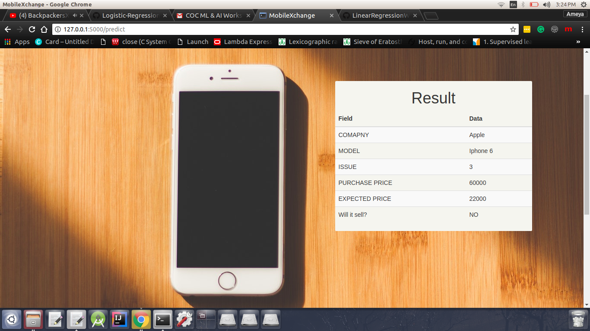

# Logistic-Regression---ML-AI-Workshop-Submission-COC-

This branch contains my implementation of the algorithm behind Logistic Regression, [reference video](https://www.youtube.com/watch?v=qeHZOdmJvFU&list=PLZ9qNFMHZ-A4rycgrgOYma6zxF4BZGGPW) 

The code was written by taking snippets from the previous workshop, and I would like to thank [Ankitesh](https://github.com/ankitesh97) for making the code open source and quite easy to tweak to fit this model as well.

## Important parameters that seem to be working well :
1. Accuracy      = 99.33333 %
2. Learning Rate = 1e1
3. EPOCHS        = 70000

The flask implementation is almost identical to that of the master branch, with minor changes in the [Server Code](app/server.py) to utilize the model with the Normalized Data in it.
